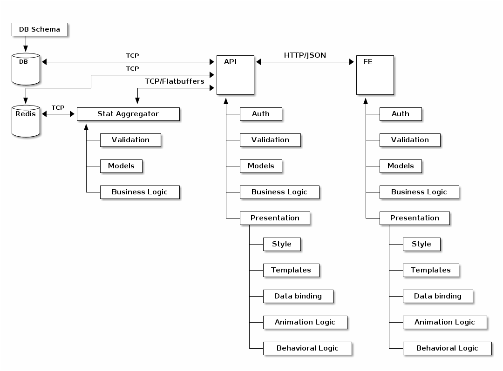

---

**This is a work in progress. It will likely become a book at some point.**

---

# Analyzing the State of the Art

With todays applications, there is typically a focus on serving large numbers of
people across multiple platforms. This is complicated by those various platforms
requiring different languages and technologies in order to implement each part.
Many languages have been focused on incremental improvements over previous
languages. This is also the case for many web technologies.

We have a wide variety of languages which can be used on the server side. In
fact, our choice on the server side is nearly unlimited and is only constrained
by convenience or special needs. Clients can be written in many different
languages, especially given the rise of transpilers. Generally, browser based
apps are constrained to languages which readily allow usage of JavaScript
libraries. Client apps on iOS are limited Objective C, Swift, and other 
languages which transpile to Javascipt running in a web view. Android apps are
limited to languages which run in the JVM, languages with a C interface which
can be called from within the JVM, and languages which transpile to JavaScript
running in a web view.
+
In the recent few years, web apps have started to mature in their approach to
using components, data binding, and approaches to manipulating the DOM. Methods
like Relay and GraphQL have also simplified the serialization of data for views.
Other technologies like flat buffers on ArrayBuffers, service workers, and HTTP/2
have allowed speeding up the tranfer of data.

Despite all of these improvements, web application development is still not too
far removed from where it was in the beginning when JavaScript and VBScript were
just taking off in browsers. Programming is still stuck in low level thought,
while apps are much broader in scope. Our languages and tools have not kept up
with the complexity of what we try to accomplish. Most of our programming
languages are still systems programming laguages leaving us to repeat oursleves
over and over again.

## Duplication in Architecture

Let's analyze a relative simple web application that could be something from real
life. Each of the components may be physically duplicates and load balanced. We
have a system composed of:

1. Websever which serves front end code.
1. Backend API service proxied through the webserver.
1. Database which holds all the data for the system.
1. Service which collects and aggregates statistics from the system in Redis.
1. Redis keystore which stores the online aggregation of data and also stores
   the session data in another database.




We can see a lot duplication which should be examined in order to determine if
there are any opportunities for reducing complexity. The first set of duplicates
to bring attention to are the aspects of **data modeling** and **validation**.

There's actually a decent level of complexity going on here which needs to be
appreciated. Several other systems (not included here) likely interact with the
backend service. In many systems around today, there is likely an additional
service worker which handles longer running tasks. I'm omitting all of that, just
to focus on the core of the problem.



sequenceDiagram
	autonumber

	participant A as Alice
	participant B as Browser
	participant WS as Web Server
	participant API
	participant S as Service
	participant DB
	participant R as Redis

	A ->> B: Navigates to site
	B ->> WS: Initial Request
	activate WS
	WS -->> B: Returns Frontend (FE) to Browser
	deactivate WS
	B ->> WS: Auth check
	activate WS
	WS ->> API: Auth check (cont.)
	activate API
	API ->> R: Retrieve session data
	activate R
	R -->> API: Session data
	deactivate R
	API -->> WS: Return session, if exists
	deactivate API
	WS -->> B: Session (cont.)
	deactivate WS
	B ->> WS: Asset request
	activate WS
	B ->> WS: Asset request
	WS -->> B: Return asset
	WS -->> B: Return asset
	deactivate WS
	B ->> A: Sees the UI

	A ->> B: Requests with UI
	B ->> WS: FE requests from API
	activate WS
	WS ->> API: Webserver proxies to API
	activate API
	API ->> DB: API requests data from DB
	activate DB
	DB -->> API: DB returns data to API
	deactivate DB
	API -->> WS: API proxies through webserver
	deactivate API
	WS -->> B: FE receives the data from the API
	deactivate WS
	B -->> A: Sees update

	A ->> B: Requests with UI
	B ->> WS: FE requests from API
	activate WS
	WS ->> API: Webserver proxies to API
	activate API
	API ->> S: API requests data from S
	activate S
	S ->> R: S requests data from Redis
	activate R
	R -->> S: Redis returns data to Service
	deactivate R
	S -->> API: Returns data to API
	deactivate S
	API -->> WS: API proxies through webserver
	deactivate API
	WS -->> B: FE receives the data from the API
	deactivate WS
	B -->> A: Sees update



With this diagram and the one above, we can begin to see the complexity of
serializing, marshalling, and validating data and how it relates to the
duplication of the data models across multiple systems.


## Duplication I: Data Definitions, Validations, and Serialization

In this example let's assume the API is written in Ada, the FE is written
in JavaScript, the Service is written in C++, and the database schema is in a
MySQL dialect. This means that we have duplication of:

* the type specifications in four different languages.
* validation constraints in four different laguages.
* serialization of these models in three different languages (the DB already has
  a serialization format built in, but I'm not counting it since we don't have to
  specify it or manually wire it).

Let's take an overview of each of these. First, there's the SQL definition of the
table. There's a few things we need to notice about this. It uses the database's
built-in types. It specifies ranges on the length of certain fields. Curiously,
besides basic type safety, it provides no actual verification of the data for
patterns. If there was an `EMAIL` type in SQDL's DDL, it would be able to
validate the form of the email address according to the RFC. This, of course, 
would be less than ideal given the latency in verifying the form of the data by
going through two network connections, with one potentially having less than
ideal properties. Additionally, since databases 

```sql
-- Using types provided by the database which may be different than the types
-- provided by other languages.
CREATE TABLE person (
    id            INTEGER       PRIMARY KEY,
    first_name    VARCHAR(50)   not null,
    last_name     VARCHAR(75)   not null,
    nick_name     VARCHAR(50)   not null,
    dateofbirth   DATE          not null
);
```

```ada
-- Ada doesn't have a standard Date type, but if you know Ada it's really easy
-- to make your own date record type with bound checking. So assume we've defined
-- a Date type in `SomeLibrary`.
with SomeLibrary.Date
type Person is record
    id          : Integer;
    firstName   : String(1 .. 50);
    lastName    : String(1 .. 75);
    nickName    : String(1 .. 50);
    dateOfBirth : SomeLibrary.Date;
end record
```

```c++
/*
 * C++ also doesn't have a built in Date type, but we could build one using
 * <ctime> and adding a bit of math. For simplicity's sake, lets assume we've
 * already defined one in SomeLibrary.
 */

#include "some_library.h"
using namespace SomeLibrary;
 
class Person {
	int id;
	char* firstName;
	char* lastName;
	char* nickName;
	Date dateOfBirth;
}
```

```js
/*
 * While JavaScript has a built in Date object. It is not a type. We know this
 * because `typeof (new Date()) === 'object'`. This is on top of JavaScript
 * not being a statically typed language, so it doesn't matter so much.
 */

class Person {
	id;
	firstName;
	lastName;
	nickName;
	dateOfBirth;
}
```

## Duplication II: Business and Workflow Logic


## Duplication III: Views and Rendering


